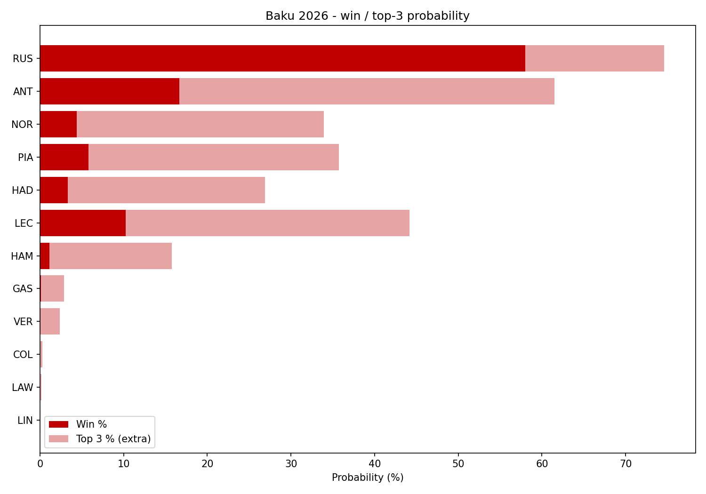

# Baku 2026 Grand Prix Predictor

A machine learning model that predicts the 2026 Azerbaijan Grand Prix, built on real
F1 timing data through [FastF1](https://github.com/theOehrly/Fast-F1).

Instead of spitting out one guess at the finishing order, it simulates the whole race
**10,000 times** and counts how often each driver wins, gets a podium, scores points
or doesn't finish at all.



## How it works

There are four layers, and each one was built and tested on its own before being
put together.

| Layer | Question it answers | Built from |
|---|---|---|
| Race pace | How quick is each car in clean air? | Qualifying gap, speed trap, season form and engine supplier, through an ensemble of Ridge, Random Forest and XGBoost |
| Retirement risk | How likely is each car to break or crash? | Every retirement this season plus Baku 2021-2025, split up by cause |
| Tyres and pit stops | What do tyres and stops actually cost here? | 3,797 green flag laps and 78 real pit stops at Baku |
| Monte Carlo | What happens across 51 laps? | Lap by lap: track position, traffic, tyre wear, stops, safety cars, retirements |

### The parts I think are interesting

Qualifying already tells you who's quick. The point of this model is everything
qualifying can't tell you.

- **Retirements are split by cause.** Engine failures are scored per engine
  supplier, because four teams running a Mercedes are all evidence about the same
  engine. Gearboxes go by team, crashes by driver.
- **Corner level crash history.** Turn 3 and Turn 15 cause most of the incidents
  here, so crash risk isn't just one flat number.
- **Engine spec per driver.** In 2026 two drivers in the same team can be on
  different engine specs, so it's tracked individually instead of team wide.
- **A grid penalty moves you back without making your car slower.** Track position
  and car pace are kept completely separate, which sounds obvious but is easy to get
  wrong when grid position is also a feature.
- **A crashed qualifying lap isn't treated as a slow car.** Antonelli put it in the
  wall in Q1 here and starts P16. His lap was 1.8% off, but he was 0.34% off in FP3,
  so the model uses his practice pace and still starts him where he qualified. He
  gets to recover without being handed pace he never actually showed.

## Does the ML actually beat just guessing?

Everything is tested walk forward. To predict round N it only ever trains on rounds
before N, so nothing from the future leaks back in.

Predicting clean air race pace, rounds 6-14:

| Model | Pace error (MAE, %) | Driver order off by |
|---|---|---|
| Qualifying gap only, no ML | 0.53 | 1.58 places |
| Qualifying gap, rescaled | 0.48 | 1.58 places |
| Ridge | 0.41 | 1.69 places |
| Random Forest | 0.40 | 1.59 places |
| XGBoost | 0.42 | 1.81 places |
| **Ensemble of the three** | **0.39** | 1.69 places |

The honest read: the ensemble is about 17% better at working out *how far apart* the
cars are, but it is **no better than qualifying on its own at ordering drivers**.
Qualifying already knows who's fast. The model earns its place in the simulation
layer instead, with retirements, tyres and safety cars.

The full simulator was tested the same way and beats "everyone finishes where they
started" by roughly one position per driver (1.67 vs 1.89 places off, finishers only).

## Running it

```bash
python -m venv .venv && ./.venv/bin/pip install -r requirements.txt
./.venv/bin/python predict_baku.py
```

Needs Python 3.10+, since FastF1 3.8 is required for 2026 telemetry.

Update the qualifying CSVs in `data/` and the flags at the top of `predict_baku.py`
after qualifying, then run it. Everything else is already trained.

### Files

| File | What it does |
|---|---|
| `predict_baku.py` | Main script, ties everything together and produces the prediction |
| `race_sim.py` | The lap by lap race simulator |
| `pace_data.py` / `pace_model.py` | Builds the race pace dataset and tests the models against baselines |
| `dnf_risk.py` | Retirement probability per car, by cause |
| `tyre_pitstop.py` | Measures Baku tyre wear, pit loss and real strategies |
| `baku_features.py` | Baku specialist score and the driver variance multiplier |
| `baku_telemetry.py` | Speed traces with the real corner positions |
| `backtest_sim.py` | Walk forward testing for the whole simulator |

## What it doesn't do

Putting this here because a model that hides its weak spots isn't worth trusting.

- **Safety car strategy isn't reactive.** Strategies are sampled from what teams
  actually did at Baku, so no car decides to pit *because* a safety car came out,
  which is the biggest strategy call there is at this track.
- **Only full safety cars.** 2022 and 2024 were virtual safety cars and 2021 had a
  red flag, and those play out differently.
- **The dirty air number is a judgement call.** Traffic costs 0.9s a lap, picked so a
  quick car starting near the back recovers about as far as the only two comparable
  real cases (Norris P15 to P4, Hamilton P19 to P9, both Baku 2024). Two cases is not
  a real calibration.
- **Practice data isn't used for pace.** Getting race pace out of practice needs
  proper stint by stint work, because cars refuel between runs and the lap times mix
  push laps with cool down laps.
- **The tyre layer is only lightly tested.** Five past Baku races is a small sample.
  The wear numbers are measured, but their effect on the finishing order isn't proven.
- **Small samples everywhere.** 22 drivers and 14 races isn't much, which is why
  retirement rates get shrunk towards the grid average instead of taken at face value.

## Data

Timing, telemetry and results all come from FastF1. Retirement causes were put
together from race reports and checked against FastF1's own classifications, and
every row records where it came from.
